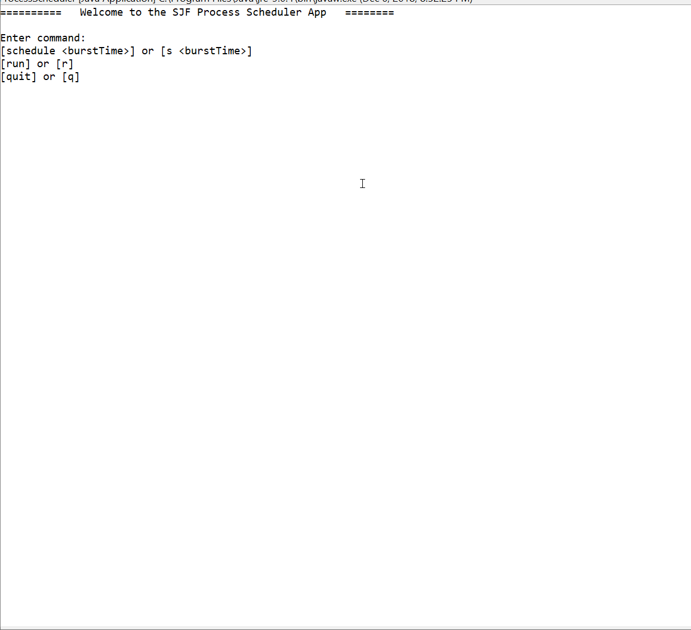

# SJF-PROCESS-SCHEDULER
 
In **SJF-PROCESS-SCHEDULER** we are going to implement a very simple version of a process scheduler that employs the Shortest Job First (SJF) scheduling policy. Job or process scheduling policies are used to dequeue the most appropriate job to execute next. In particular, Shortest Job First (SJF), or shortest job next scheduling policy selects the ready process with the smallest execution time (aka burst time) to execute next. (Burst Time: Time required by a process to be executed in the Central Processing Unit (CPU).) This represents an interesting use case of the priority queue abstract data type implemented using a min-heap.

Author: **[Ajmain Naqib](mailto:naqib@wisc.edu)**

Course: CS300, Fall 2018    Lecturer's Name: Gary Dahl

Time spent: **  ** hours spent in total

## Project Introduction
Your computer performs multiple processes, ranging from mundane stuff like disk checkup to more important matters such as installing Eclipse. The process scheduler is an important component of the operating system that is responsible for deciding which process will run next. In this assignment, we are going to develop a simple process scheduler to schedule processes that are ready to be run. This scheduler consists of only one processor. This means that only one process can be executed at a time. Our scheduler will run on a heap-based priority queue, and will operate conforming to the SJF scheduling policy. This means that ready processes with the shortest burst time have the highest priority to execute first. 

The goals of this assignment include:

* Developing, using, and testing an implementation of a Priority Queue as a min-heap.  
* Implementing several fundamental operations on this data structure including insertion, removal, and peek operations with respect to the problem specification.

The following **required** functionality is completed:

* [ ] DEFINE THE WAITINGQUEUEADT INTERFACE
* [ ] IMPLEMENT THE CUSTOMPROCESS CLASS
* [ ] IMPLEMENT THE CUSTOMPROCESSQUEUE CLASS
* [ ] IMPLEMENT THE PROCESSSCHEDULER CLASS
* [ ] IMPLEMENT THE DRIVER METHOD OF THE PROCESSSCHEDULER APPLICATION
* [ ] IMPLEMENT THE TESTS

Optional: 
* [ ] You can expand the heap array in your CustomProcessQueue class using a shadow array.
* [ ] You can update your program to provide a log with the following statistics (metrics) for every process being run:
 - Arrival Time: Time at which the process arrives in the ready queue (is scheduled).
 - Completion Time: Time at which process completes its execution.
 - Burst Time: Time required by a process for CPU execution.
 - Turn Around Time: Time Difference between completion time and arrival time.  (Turn Around Time = Completion Time – Arrival Time)
 - Waiting Time : Time Difference between turn around time and burst time. (Waiting Time = Turn Around Time – Burst Time)
 - Response Ratio = (Waiting Time + Burst time) / Burst time

More information about this project can be found [here.](http://cs300-www.cs.wisc.edu/wp/index.php/2018/11/26/p10-sjf-process-scheduler/) 

## Video Walkthrough

Here's a walkthrough of implemented functionality:

GIF created with [LiceCap](http://www.cockos.com/licecap/).

## Notes

## License

    Copyright [2018] [Ajmain Naqib]

